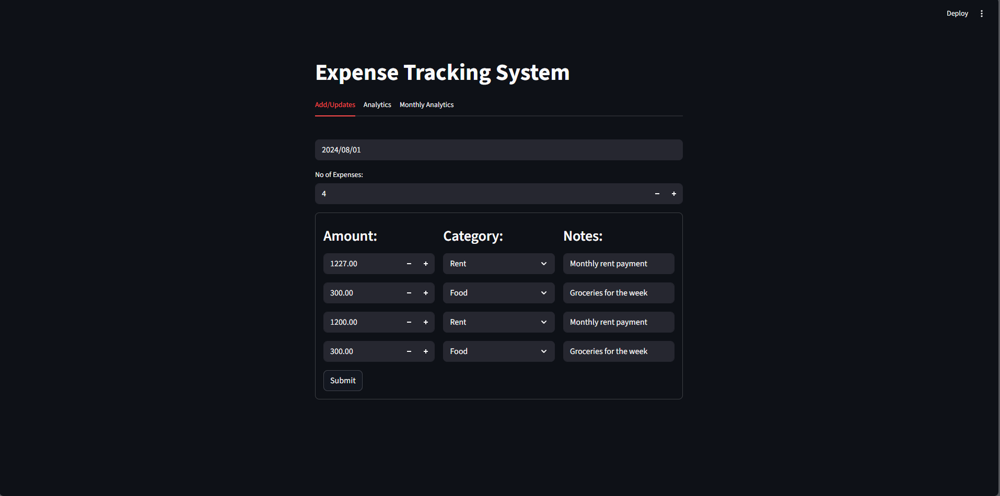
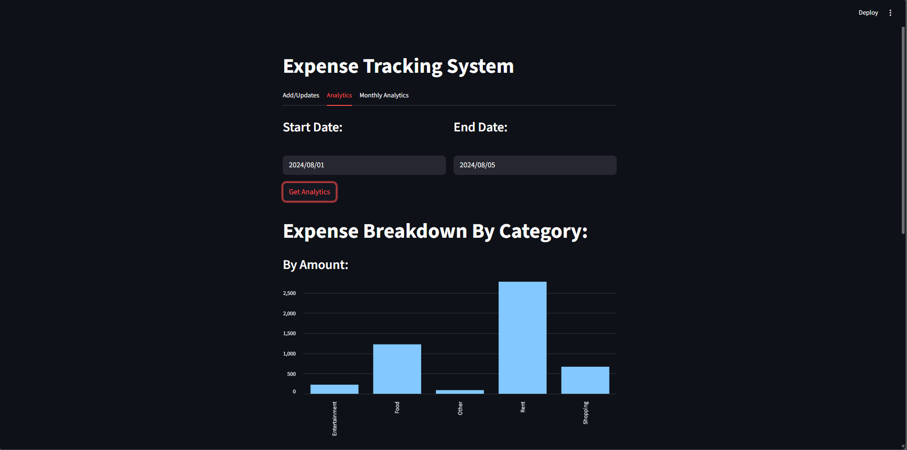
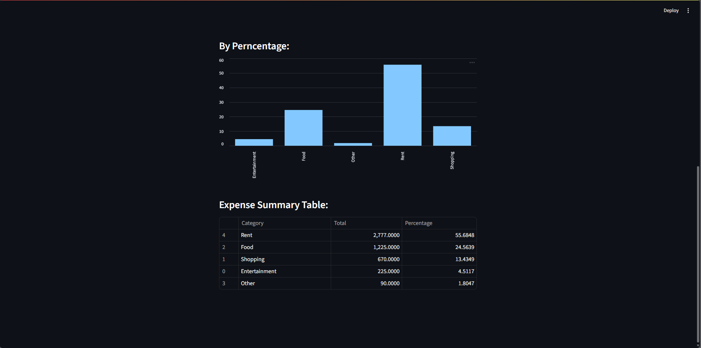
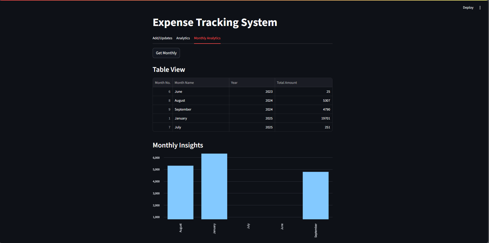

# 🚀Expense Tracking System

📝This project is an Expense Tracking System that consist of Streamlit Frontend application and a FastAPi Backend Server. This Project is First Project That I ever Made.

## ✨ Features

- ➕ Add, update, and delete daily expenses
- 📅 Filter expenses by date range
- 📊 View category-wise analytics with percentages
- 🧠 Simple and interactive UI with Streamlit
- ⚡ FastAPI backend with clean API structure

  <p align="center">
  
  
  
  
  
</p>


## 📦 Requirements
- Python 3.10+
- FastAPI
- Streamlit

## 📁Project Structure

- **frontend/🖥️**: Contain the Streamlit application code.
- **backend/🎨**: Contain the FastAPI backend server code.
- **tests/🧪**: Contain the Test cases for both frontend and backend code.
- **requirements.txt📦**: Lists the reqiured Python Packages.
- **README.md📋**: Provides an Overview and Instruction for the Project.

## 🛠️ Setup Instructions

1. **Clone the repository**:
   ```bash
   git clone https://github.com/BhargavRavalce19/Expenses-Tracking-System
   cd project
   ```

1. **Install dependencies**:
    ```commandline
   pip install -r reqiurements.txt
   ```
   
1. **Run the FastAPI server:**
    ```commandline
   uvicorn server.server:app --reload
   ```
   #### **Visit API docs: http://127.0.0.1:8000/docs**

1. **Run the Streamlit app:**:
    ```commandline
   streamlit run frontend/app.py
   ```
   
## 👨💻 Developed By Bhargav Raval
### 📧 [bhargavraval.ce19@gmail.com]

